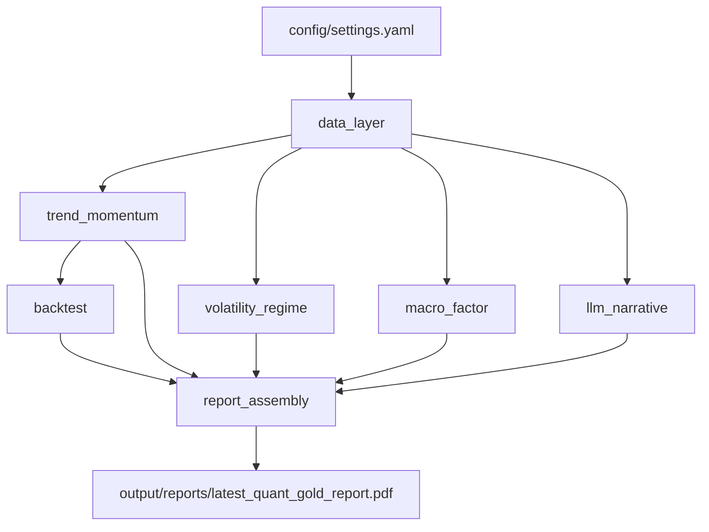
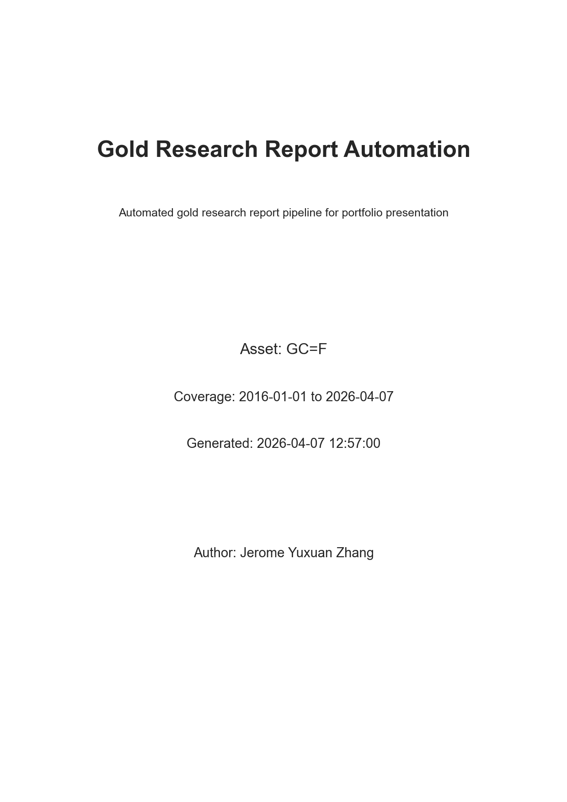
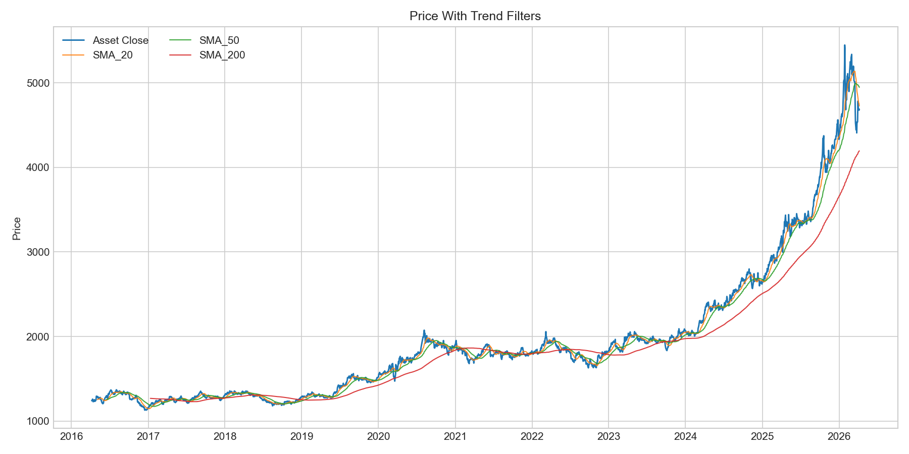

# quant-gold-report-polaris

`quant-gold-report-polaris` is a portfolio project for MFE applications: an end-to-end pipeline that downloads free gold and macro data, runs explainable quantitative analysis, and assembles the results into a research-style PDF with an optional LLM-generated narrative layer. The point is not to overclaim alpha; it is to demonstrate quantitative engineering, financial intuition, honest backtesting, and a disciplined AI workflow.

## Why This Project

- Build a genuinely demo-able automated gold research report from real market and macro data
- Show the intersection of quantitative finance, macro factor thinking, and production-minded Python engineering
- Keep every modeling choice explainable enough to discuss clearly in an interview or with a professor

## What It Does

- Pulls gold, DXY, Treasury yield, CPI, real-yield, GLD proxy, and optional Shanghai gold data
- Computes trend, momentum, volatility regime, rolling correlation, OLS factor exposure, and walk-forward backtest results
- Generates charts, summary tables, and a portfolio-ready PDF report
- Uses Anthropic when an API key is available and falls back to a deterministic template narrative when it is not

## Architecture



## Quickstart

```bash
pip install -r requirements.txt
python main.py
```

Running `python main.py` downloads fresh data when available, falls back to cached snapshots if remote sources fail, and writes the latest PDF to `output/reports/latest_quant_gold_report.pdf`.

## Demo Output

- Latest PDF report: [output/reports/latest_quant_gold_report.pdf](output/reports/latest_quant_gold_report.pdf)
- Latest cover preview: [output/charts/latest_cover_preview.png](output/charts/latest_cover_preview.png)
- Latest trend chart: [output/charts/latest_trend_momentum.png](output/charts/latest_trend_momentum.png)

## Repo Layout

```text
config/            runtime settings
data/raw/          immutable raw snapshots
data/processed/    aligned parquet datasets
docs/              math notes and explanations
notebooks/         exploration scratchpad
output/charts/     generated chart artifacts
output/reports/    generated PDFs
src/               production modules
main.py            end-to-end entry point
```

## What I Learned

### Module 1: Data Layer

I learned that the data layer is already part of the research argument. Choosing gold, the dollar, CPI, and real yields forces me to explain the economic transmission mechanism rather than hiding behind a black-box feature list.

I also learned that stationarity is not an academic side note. Converting prices into log returns is what makes the later correlation, volatility, and regression modules behave like tools instead of noise amplifiers.

### Module 2: Trend and Momentum

I learned that moving averages are simple enough to explain in plain language but still rich enough to talk about filtering, lag, and responsiveness. The comparison between SMA and EMA is a nice way to show that signal design is a tradeoff, not a single correct answer.

Momentum also helped me articulate two different stories at once: behavioral underreaction and risk compensation. That makes the module easier to defend in both finance and quant interviews.

### Module 3: Volatility Regime Detection

I learned that realized volatility is useful precisely because it is humble. It tells me how turbulent the market has been, but it does not pretend to know the future, which is an important distinction when presenting results honestly.

The HMM extension pushed me to translate a more sophisticated model into interview-safe language: hidden states, transition probabilities, and regime persistence. That was good practice in making advanced methods explainable.

### Module 4: Macro Factor Analysis

I learned that rolling relationships matter more than one big full-sample number. Gold does not react to the dollar or real yields the same way in every macro regime, so rolling correlations are a more faithful description of the asset.

Running both Pearson and Spearman also reminded me that robustness checks do not need to be complicated to be valuable. Sometimes the best credibility boost is simply showing that one metric is not carrying the whole story alone.

### Module 5: Walk-Forward Backtest

I learned that backtesting is mostly about controlling my own optimism. Expanding-window walk-forward testing forces the strategy to earn its performance without peeking into the future.

I also came away with a better appreciation for why Sharpe and maximum drawdown answer different questions. One is about reward per unit of volatility, while the other is about how bad the worst experience would have felt to a real investor.

### Module 6: LLM Narrative Layer

I learned that prompt engineering is strongest when it is boring and disciplined. Injecting structured numbers and banning unsupported extrapolation is much more valuable than asking the model to sound impressive.

The fallback path without an API key was also instructive. Good automation systems should degrade gracefully instead of breaking just because one external service is unavailable.

### Module 7: Report Assembly

I learned that packaging matters. Charts, tables, and text become much more persuasive once they are assembled into a coherent PDF with a fixed research flow.

The report layer also forced me to think about honesty as part of engineering quality. A good output is not just polished; it is explicit about limitations, data quality, and what the model cannot claim.

## Sample Output

The images below are generated by the pipeline after a local run of `python main.py`.





## Honest Limitations

- This is a single-asset, single-strategy workflow without diversification.
- Dual moving-average crossovers are classic signals and should not be marketed as durable alpha.
- The walk-forward process reduces look-ahead bias, but parameter selection still has data-snooping risk.
- Transaction costs and slippage are not modeled in the baseline report.
- The LLM layer describes structured outputs; it does not predict future gold prices.
- Free data sources can contain revisions, outages, and symbol-specific quirks.
