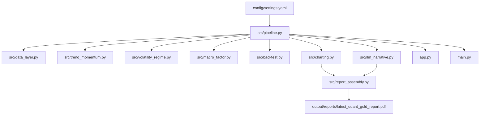

# quant-gold-report-polaris

`quant-gold-report-polaris` is an interactive research workflow for analyzing gold-linked assets through factor exposure, volatility regime detection, and walk-forward signal review. It combines reproducible data ingestion, structured quantitative analysis, a browser-based Dash terminal, and PDF report generation so the same pipeline can serve exploratory review and formal write-up.

## Research Objective

The project studies the time-varying sensitivity of gold-linked assets to dollar and real-yield shocks, then compares the behavior of a simple trend signal across different volatility regimes. The design goal is not to market a toy signal as alpha, but to present a compact research product built on transparent assumptions and auditable outputs.

## Platform Overview

- Primary interface: `python app.py` launches an interactive Dash research terminal
- Batch export: `python main.py` runs the same pipeline and produces a dated PDF report
- Default primary asset: `GLD`
- Comparison assets: `GC=F` and `Au99.99`
- Core outputs: factor charts, regime charts, signal diagnostics, backtest metrics, distribution views, and a standardized research note

## Analytical Framework

- Data layer: ingests free market and macroeconomic series, then aligns them on a business-day panel
- As-of macro handling: monthly CPI is mapped into the daily panel using a release-lag convention rather than naive forward-fill from observation month
- Trend and momentum: computes SMA, EMA, and multi-horizon price momentum
- Regime analysis: estimates realized volatility, percentile-based regime labels, and an optional two-state HMM
- Factor exposure: measures rolling Pearson and Spearman correlation plus OLS sensitivity to DXY and real-yield changes
- Strategy review: runs an expanding-window walk-forward backtest with a simple transaction-cost assumption
- Narrative layer: uses Anthropic when available and deterministic fallback text otherwise

## Application Layout

The Dash terminal is organized into six pages:

- `Overview`
- `Macro`
- `Signals`
- `Backtest`
- `Distribution / Robustness`
- `Methodology`

The left control panel supports:

- Primary asset selection
- Date range updates
- HMM toggle
- Transaction cost input in basis points
- Optional PDF generation from the same run

## Architecture



## Quickstart

```bash
pip install -r requirements.txt
python app.py
```

For batch report generation:

```bash
python main.py
```

## Latest Output

- Latest PDF report: [output/reports/latest_quant_gold_report.pdf](output/reports/latest_quant_gold_report.pdf)
- Latest cover preview: [output/charts/latest_cover_preview.png](output/charts/latest_cover_preview.png)
- Latest trend chart: [output/charts/latest_trend_momentum.png](output/charts/latest_trend_momentum.png)

## Repo Layout

```text
config/            runtime settings
data/raw/          immutable raw snapshots
data/processed/    aligned parquet datasets
docs/              methodology and mathematical notes
notebooks/         exploration scratchpad
output/charts/     latest exported PNG artifacts
output/reports/    generated PDF research notes
src/               production pipeline modules
app.py             Dash research terminal
main.py            batch PDF entry point
```

## Sample Output


## Design Choices

- The primary research asset is configurable, but the repository defaults to `GLD` to keep the main report tied to a tradable benchmark
- `GC=F` and `Au99.99` are treated as comparison assets, not parallel main narratives
- If only `GLD` price is used, it is described as a tradable benchmark rather than a flow proxy
- Distribution analysis is placed in robustness views and appendix material instead of replacing the core time-series charts

## Limitations

- This is a single-asset, single-signal review rather than a diversified portfolio study
- Dual moving-average crossovers are intentionally simple and should not be framed as persistent alpha
- The CPI as-of treatment is more disciplined than naive forward-fill, but historical revisions can still make ex-post analysis cleaner than real-time conditions
- Transaction costs are represented by a simple basis-point model and do not include slippage, taxes, or impact
- The narrative layer is descriptive only and does not produce forecasts
- Free data sources can contain gaps, revisions, outages, and symbol-specific inconsistencies

## For Reviewers

If you only have two minutes, review:

1. [latest_quant_gold_report.pdf](output/reports/latest_quant_gold_report.pdf)
2. [settings.yaml](config/settings.yaml)
3. [pipeline.py](src/pipeline.py)
4. [math_notes.md](docs/math_notes.md)

That path shows the output, configuration surface, execution flow, and methodological boundaries with minimal context switching.

