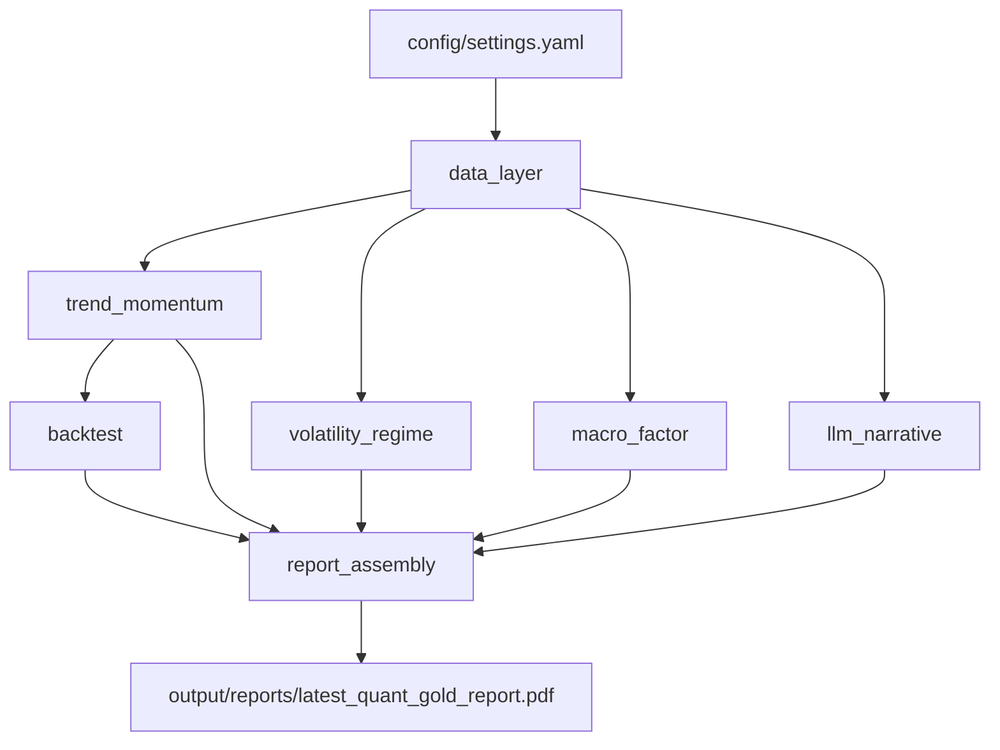

# quant-gold-report-polaris

`quant-gold-report-polaris` is an automated research pipeline that transforms free gold and macroeconomic data into a standardized PDF report. The workflow combines market data ingestion, factor-based analysis, volatility regime detection, walk-forward backtesting, and a constrained narrative layer so the final output reads more like a compact investment research product than a notebook experiment.

## At a Glance

- Input: free market and macro data for gold, the dollar, yields, inflation, and ETF proxy flows
- Core analysis: trend and momentum signals, volatility regime detection, rolling macro correlation, OLS factor exposure, and walk-forward backtesting
- Output: a dated PDF research report with charts, tables, methodology notes, and a constrained narrative layer
- Format: modular, reproducible, and designed for research review rather than model marketing

## Research Objective

The objective of this repository is to produce a repeatable gold market research report from transparent inputs and explainable methods. The pipeline is built around three principles: data should come from free and inspectable sources, analytics should be simple enough to defend economically, and outputs should disclose limitations rather than overstate predictive power.

## Report Structure

- Cover page with asset, date range, and generation timestamp
- Executive summary grounded on realized statistics
- Market overview with price and volatility regime visuals
- Macro factor section with rolling correlations and OLS summary
- Quantitative signal review with equity curve and performance table
- Risk and limitations section with explicit disclosure
- Appendix with source and methodology references

## Analytical Framework

- Data layer: pulls gold, DXY, Treasury yield, CPI, real-yield, GLD proxy, and optional Shanghai gold data
- Market signals: computes SMA, EMA, and multi-horizon price momentum
- Regime analysis: estimates realized volatility, percentile-based regimes, and an optional two-state HMM
- Factor analysis: measures rolling Pearson/Spearman correlation and OLS sensitivity to DXY and real-yield changes
- Strategy review: runs an expanding-window walk-forward backtest on a dual moving-average signal
- Narrative assembly: uses Anthropic when available and falls back to deterministic templates when it is not

## Architecture



## Quickstart

```bash
pip install -r requirements.txt
python main.py
```

Running `python main.py` downloads fresh data when available, falls back to cached snapshots if remote sources fail, and writes the latest PDF to `output/reports/latest_quant_gold_report.pdf`.

## Key Design Choices

- The report is generated from structured module outputs rather than notebook-side manual edits
- The LLM layer is constrained to description and supported by a no-key fallback path
- Walk-forward evaluation is used to reduce look-ahead bias in signal review
- Limitations are treated as part of the deliverable, not as footnotes after the fact

## Latest Output

- Latest PDF report: [output/reports/latest_quant_gold_report.pdf](output/reports/latest_quant_gold_report.pdf)
- Latest cover preview: [output/charts/latest_cover_preview.png](output/charts/latest_cover_preview.png)
- Latest trend chart: [output/charts/latest_trend_momentum.png](output/charts/latest_trend_momentum.png)

## Repo Layout

```text
config/            runtime settings
data/raw/          immutable raw snapshots
data/processed/    aligned parquet datasets
docs/              math notes and explanations
notebooks/         exploration scratchpad
output/charts/     generated chart artifacts
output/reports/    generated PDFs
src/               production modules
main.py            end-to-end entry point
```

## Sample Output

The images below are generated by the pipeline after a local run of `python main.py`.


## Honest Limitations

- This is a single-asset, single-strategy workflow without diversification.
- Dual moving-average crossovers are classic signals and should not be marketed as durable alpha.
- The walk-forward process reduces look-ahead bias, but parameter selection still has data-snooping risk.
- Transaction costs and slippage are not modeled in the baseline report.
- The LLM layer describes structured outputs; it does not predict future gold prices.
- Free data sources can contain revisions, outages, and symbol-specific quirks.

## For Reviewers

If you only have two minutes, start with the latest PDF report, then review `config/settings.yaml`, `src/backtest.py`, and `docs/math_notes.md`. That path shows the output, parameterization, evaluation logic, and methodological support with minimal context switching.
